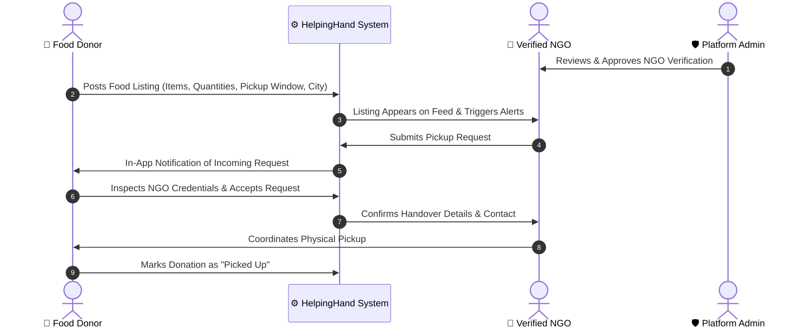

# 🤝 HelpingHand

<p align="center">
  <strong>A Community-Driven Food Redistribution & Surplus Donation Platform</strong>
</p>

<p align="center">
  
  
  
  
  
</p>

---

## 📖 Overview

**HelpingHand** bridges the gap between surplus food providers (households, restaurants, event organizers) and verified charitable organizations (NGOs, shelters, community kitchens).

The platform allows donors to publish itemized surplus food listings with precise pickup windows, and empowers verified NGOs to request and coordinate collections — minimizing food waste and supporting local communities.

The repository is organized as a clean, two-tier fullstack monorepo:
1. **`mainweb/`**: Public-facing platform for Food Donors and NGOs.
2. **`admin/`**: Secured back-office operations portal for NGO verification, user moderation, and fraud prevention.

---

## 🏛️ System Architecture & Ports

```
HelpingHand/
├── mainweb/                  # User & NGO Portal
│   ├── client/               # React 18 SPA (Port 3000)
│   └── server/               # Express 5 API Server (Port 5000)
│
└── admin/                    # Platform Admin & Moderation Portal
    ├── client/               # React 18 SPA (Port 3001)
    └── server/               # Express 5 API Server (Port 5001)
```

| Component | Layer | Port | URL / Health Check | Primary Function |
|---|---|---|---|---|
| **Main Web Client** | Frontend | `3000` | [http://localhost:3000](http://localhost:3000) | Donor & NGO dashboard, listings, and notifications |
| **Main Web Server** | Backend | `5000` | [http://localhost:5000/api/health](http://localhost:5000/api/health) | Authentication, donation lifecycle, and notifications |
| **Admin Client** | Frontend | `3001` | [http://localhost:3001](http://localhost:3001) | NGO verification, user directory, and fraud management |
| **Admin Server** | Backend | `5001` | [http://localhost:5001/api/admin/health](http://localhost:5001/api/admin/health) | Administrative analytics, review workflows, and moderation |
| **Database** | Database | `27017` | `mongodb://127.0.0.1:27017/helpinghand` | Shared MongoDB database |

---

## 🔄 How It Works (Donation Lifecycle)



---

## 🌟 Key Features

### 🍱 Main Web App (Donors & NGOs)

- **Dual-Role Onboarding & Authentication**:
  - Secure phone-based JWT login and registration with salted `bcryptjs` password hashing.
  - Role-adaptive dashboard automatically routes users according to their verified NGO or donor status.
  - Blacklist validation checks against banned phone numbers during registration.

- **Itemized Multi-Food Donations**:
  - Donors can list multiple food items in a single post with custom quantities and units (`portions`, `kg`, `packets`, `pieces`, `litres`).
  - Dietary classification (`veg` / `nonveg`).
  - Strict timing window: specify pickup start (`pickupFrom`), pickup end (`pickupTo`), and expiry time.
  - Detailed location logging with address and city.

- **Request & Handover Negotiation**:
  - **Pickup Requests**: Verified NGOs can place pickup requests directly on available listings.
  - **Donor Review**: Donors can inspect the requesting NGO's verified status, coordinator name, and direct phone before approving.
  - **Accept & Decline**: Donors choose which NGO receives the food. Declining keeps the listing open for others.
  - **Re-Open & Release**: If an NGO fails to pick up the food, the donor can release the listing back to `available`.
  - **Pickup Confirmation**: Both parties track the listing through to `pickedUp` status.

- **Real-Time Notification Engine**:
  - In-app notification center with real-time unread badges.
  - Instant alerts for new pickup requests, acceptance, cancellation, and handovers.
  - Bulk "Mark all as read" and individual status toggling.

- **NGO Application Portal**:
  - Registered users can submit an NGO application directly from their profile with organization and coordinator details.

- **Automated Expiration Daemon**:
  - Background worker (`node-cron`) automatically flags expired food listings once the pickup window has elapsed.

---

### 🛡️ Admin Management Portal

- **Secure Administrator Access**:
  - Protected single-admin credential management.
  - Built-in automatic database seed for admin credentials upon initial launch.

- **Executive Analytics Dashboard**:
  - Real-time aggregate platform metrics: total registered donors, verified NGOs, pending applications, active listings, and completed handovers.

- **NGO Application Review**:
  - Review comprehensive applicant data including organization name, address, city, and coordinator phone.
  - Actions: **Approve**, **Reject**, or reset to **Pending**.
  - Append timestamped internal audit notes to any NGO record.

- **User & Donor Directory**:
  - Centralized directory of registered accounts with search and city filter.
  - Ability to inspect user activity, edit account records, or delete users.

- **Fraud Prevention & Phone Blacklist**:
  - Instant account suspension with mandatory audit reason.
  - Automatic synchronization with the `BlockedPhone` blacklist to prevent banned actors from re-registering under new profiles.
  - Centralized blocked accounts list with one-click unblock support.

---

## 🛠️ Technology Stack

| Domain | Technology | Purpose |
|---|---|---|
| **Frontend** | React 18, React Router v6 | Single-Page Applications |
| **UI Components** | Bootstrap 5, Lucide React | Modern, responsive layout and icons |
| **Notifications** | React Hot Toast | User feedback and toast messages |
| **Backend** | Node.js, Express 5 | RESTful APIs and middleware |
| **Database** | MongoDB with Mongoose 9 | Document storage and schema modeling |
| **Authentication** | JSON Web Tokens (JWT) & bcryptjs | Stateless auth & password security |
| **Scheduling** | node-cron | Periodic job to mark expired listings |

---

## ⚙️ Environment Configuration

Ensure that each of the four modules has its `.env` file configured before starting:

### 1. Main Web Backend (`mainweb/server/.env`)
```env
PORT=5000
MONGO_URI=mongodb://127.0.0.1:27017/helpinghand
USER_JWT_SECRET=helpinghand_dev_secret_change_me
```

### 2. Main Web Frontend (`mainweb/client/.env`)
```env
PORT=3000
REACT_APP_API_URL=http://localhost:5000
BROWSER=none
```

### 3. Admin Backend (`admin/server/.env`)
```env
PORT=5001
MONGO_URI=mongodb://127.0.0.1:27017/helpinghand
ADMIN_JWT_SECRET=helpinghand_admin_dev_secret_change_me
ADMIN_PASSWORD=admin123
ADMIN_PASSWORD_HASH=
```
> *Note: If `ADMIN_PASSWORD_HASH` is left blank, the server automatically hashes `ADMIN_PASSWORD` (defaults to `admin123`) on startup.*

### 4. Admin Frontend (`admin/client/.env`)
```env
PORT=3001
REACT_APP_API_URL=http://localhost:5001
BROWSER=none
```

---

## 🚀 Quick Start Guide

### Prerequisites
- [Node.js](https://nodejs.org/) (v18+)
- [MongoDB](https://www.mongodb.com/) running locally on port `27017`

### Step 1: Install Dependencies
```bash
# Main Web
cd mainweb/server && npm install
cd ../client && npm install

# Admin Panel
cd ../../admin/server && npm install
cd ../client && npm install
```

### Step 2: Start All Services

Open four terminal windows (or tabs) and run each command:

```bash
# Terminal 1 - Main Web Backend
cd mainweb/server
npm run dev

# Terminal 2 - Main Web Frontend
cd mainweb/client
npm start

# Terminal 3 - Admin Backend
cd admin/server
npm run dev

# Terminal 4 - Admin Frontend
cd admin/client
npm start
```

Once running, browse to:
- **Main Web**: [http://localhost:3000](http://localhost:3000)
- **Admin Panel**: [http://localhost:3001](http://localhost:3001) *(Default password: `admin123`)*

---

## 📚 API Reference

### Main Web API (`http://localhost:5000`)

| Method | Endpoint | Description | Auth |
|---|---|---|:---:|
| `GET` | `/api/health` | Service health and MongoDB status | Public |
| `POST` | `/api/auth/register` | Register a new user or NGO account | Public |
| `POST` | `/api/auth/login` | Login and receive user JWT | Public |
| `GET` | `/api/donations` | Browse available food listings | User |
| `POST` | `/api/donations` | Publish a new food listing with items | User |
| `GET` | `/api/donations/mine` | View personal donation/request history | User |
| `GET` | `/api/donations/:id` | View listing details and status | User |
| `POST` | `/api/donations/:id/request` | NGO requests food pickup | User |
| `POST` | `/api/donations/:id/cancel-request` | NGO cancels their pickup request | User |
| `POST` | `/api/donations/:id/requests/:reqId/accept` | Donor accepts specific NGO pickup request | User |
| `POST` | `/api/donations/:id/requests/:reqId/decline` | Donor declines specific NGO pickup request | User |
| `POST` | `/api/donations/:id/release` | Donor releases accepted donation back to available | User |
| `POST` | `/api/donations/:id/picked-up` | Donor marks food as successfully picked up | User |
| `GET` | `/api/donations/:id/ngo-profile/:ngoId` | View requesting NGO profile & contact info | User |
| `GET` | `/api/profile` | Get logged-in user profile | User |
| `PUT` | `/api/profile` | Update user profile details | User |
| `PATCH` | `/api/profile/password` | Change user password | User |
| `POST` | `/api/profile/apply-ngo` | Submit verification request for NGO status | User |
| `GET` | `/api/notifications` | Get user notifications feed | User |
| `GET` | `/api/notifications/unread-count` | Get unread notification badge count | User |
| `PATCH` | `/api/notifications/mark-all-read` | Mark all notifications as read | User |
| `PATCH` | `/api/notifications/:id/read` | Mark single notification as read | User |

### Admin API (`http://localhost:5001`)

| Method | Endpoint | Description | Auth |
|---|---|---|:---:|
| `GET` | `/api/admin/health` | Health and MongoDB connection status | Public |
| `POST` | `/api/admin/login` | Authenticate admin and receive admin JWT | Public |
| `PATCH` | `/api/admin/change-password` | Update admin password | Admin |
| `GET` | `/api/admin/stats` | Platform metrics and summary analytics | Admin |
| `GET` | `/api/admin/ngo-requests` | List NGO applications (filterable by status) | Admin |
| `PATCH` | `/api/admin/ngo-requests/:id/approve` | Approve an NGO's credentials | Admin |
| `PATCH` | `/api/admin/ngo-requests/:id/reject` | Reject an NGO application | Admin |
| `PATCH` | `/api/admin/ngo-requests/:id/pending` | Reset an NGO application back to pending | Admin |
| `POST` | `/api/admin/ngos/:id/note` | Append internal administrator notes | Admin |
| `GET` | `/api/admin/users` | List registered donors and users | Admin |
| `PATCH` | `/api/admin/users/:id` | Update a user profile record | Admin |
| `DELETE` | `/api/admin/users/:id` | Permanently delete a user record | Admin |
| `GET` | `/api/admin/blocked` | List all blocked users across the platform | Admin |
| `POST` | `/api/admin/users/:id/block` | Block user and register phone in blacklist | Admin |
| `POST` | `/api/admin/users/:id/unblock` | Unblock user and remove from blacklist | Admin |

---

## 🔒 Security & Data Protection

- **Namespace-Isolated JWTs**: Independent token secrets (`USER_JWT_SECRET` and `ADMIN_JWT_SECRET`) ensure separation of privilege between users and admins.
- **Salted Password Hashing**: Passwords are never stored in plaintext and use bcrypt hashing with 10 salt rounds.
- **Persistent Phone Blacklisting**: When fraudulent accounts are flagged, their phone numbers are saved to a dedicated `BlockedPhone` collection, blocking future account creation.
- **Verification Gatekeeping**: Only NGOs vetted and approved by admins can submit food collection requests.

---

## 📄 License

This project is licensed under the [MIT License](LICENSE).
